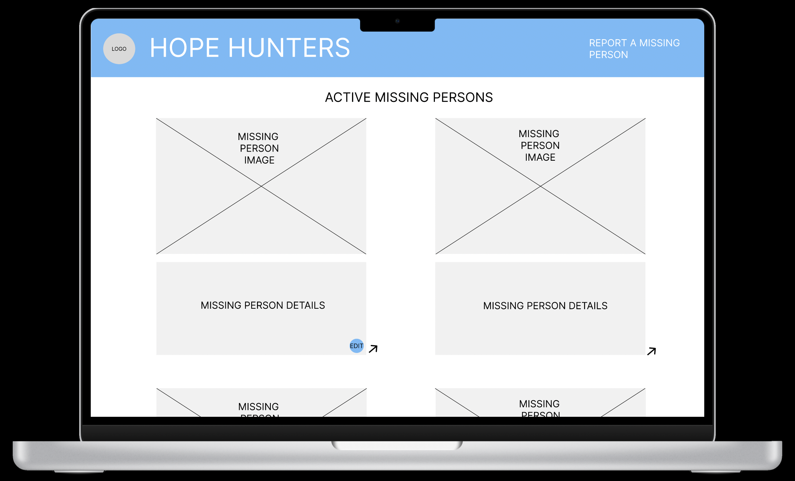
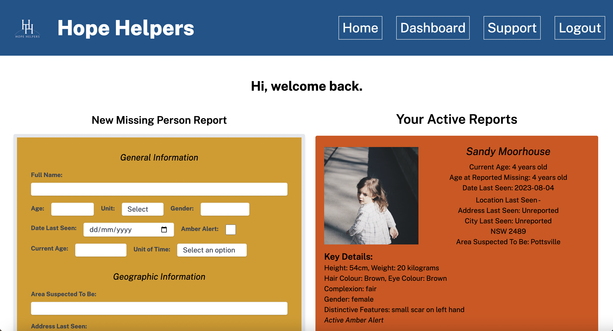

# Hope Helpers Front End

#### Connie Jacques and Sarah Landis

### Deployed Versions:
#### [Front End Demo](https://hope-helpers.netlify.app/)
#### [Back End Demo](https://hope-helpers.onrender.com/)

### Repositories:
#### [Front End Repository](https://github.com/Sarah-Connie/hope-hunters-front-end)
#### [Back End Repository](https://github.com/Sarah-Connie/hope-hunters-back-end)

### Project Management: 
#### [Project Planning](https://trello.com/b/7NMGHoN7/full-stack-app)
#### [Source Control Front End](https://github.com/Sarah-Connie/hope-hunters-front-end/branches)
#### [Source Control Back End](https://github.com/Sarah-Connie/hope-hunters-back-end/branches)

### Documentation:
#### [Preliminary Documentation (Part A)]()
____
### Technical Dependencies and Libraries Used: 
- Axios: 
   > 
   Although Fetch API was originally planned to be used in the frontend of this project to make requests to the server, Axios was the chosen library to do so instead. Axios was ultimately chosen for a few reasons including its robustness in handling errors, automatic JSON parsing, and general ease of configurability. 
   >
   Due to the way the database and the api endpoints were configured and the duties of the frontend in terms of manipulating and prepopulating forms going between plain JSON and objects with nested arrays of data, Axios seemed to be a better fit. It made the process simpler as it was easy to get the response in JSON without having to manually parse the data and do other manipulations prior to using it.
   >
   The backend also handled a lot of errors and would send them as responses when appropriate. Using axios allowed the frontend to catch these errors easily and display them as they were intended and in the correct situations.
   >
   Lastly, with the number of endpoints in the backend, setting up a baseURL made making the requests a lot simpler across numerous calls in numerous components/pages. This promotes easy modifications should the server URL ever change and/or the application be required to be scaled in the future. 
   >
   Overall Axios aided in the handling of the backend data and simplied the process of making server requests from the frontend. It also assisted in utilizing complex data structures to being able to manipulate them in a functional way.  
>
- React Responsive
    >
    `react-responsive` is a library used for manipulating rendered components depending on screen size. This library proved useful as it allowed for many conditional elements to be styled in one way for mobile screens and another way for desktops. Not only was it used for component styling but entire layouts. One example, in the `SignupVerification` component, it was required to navigate to a certain route contingent upon screen size. Using `react-responsive` assisted in doing this easily with less lines of code.
    >
    ```javascript
      const isMdScreenOrLarger = useMediaQuery({ minWidth: 768 });

     // Set a timer to navigate after 5 seconds
        const timer = setTimeout(() => {
          if (isMdScreenOrLarger) {
            navigate("/report");
          } else {
            navigate("/signup");
          }
        }, 5000);
    ```
    >
    In conjunction with the `useMediaQuery` hook, a media breakpoint was effectively set for medium screens at 768px, in which if the screen was larger than that set size, the app would effectively be able to navigate to a specific route with leaving the frontend in a breaking state.
    >
- React Share Social
    > 
    Since the frontend required a method in which to share reports to social media, some research was done to see if there were any existing packages that would assist in doing so.
    >
    `react-share` was a package that came with out of the box functionality to implement icons and buttons of a plethora of social media outlets. Implementation was made seamless. Please see a below example of how this library was used:
    >
    ```javascript
    <FacebookShareButton
        url={`https://www.hopehelpers.netlify.app/?searchQuery=${report.fullName}`}
        // url={shareUrl}
        quote={`${facebookQuote}`}
        target="_blank"
    >
        <FacebookIcon size={26} round />
    </FacebookShareButton>
    ```
    >
    To utilize this package, all that was required was to import the sharebuttons and associated icons from the library, as such
    `import { FacebookShareButton } from 'react-share';`
    and use as above. This library integration allowed the frontend to successfully integrate direct social media sharing into the application and successfully meet user expectations and needs. 
>
- Tailwind CSS
    > 
    Tailwind CSS is a popular utility-first CSS framework. Tailwind features out-of-the-box pre-defined utility classes which can be used across all frontend elements. Due to the fact that there were many reused but also dynamically rendered components, it was handy to use Tailwind as it was easier to ensure consistency across the site. No need to come up with nuanced class names to be used in CSS styling, but rather styles could be directly applied to components in the same file. 
    >
    This alone made it much easier to consistently and appropriately style the site across screensizes and different design layouts.
    >
    For example,
    >
    ```javascript
    if (error) {
        // Render the error message if there is one
        return <p className="m-5 w-[500px] flex justify-center text-red-500 text-xl md:text-2xl ml-3 italic">{error}</p>;
    }
    ```
    >
    This `<p>` element is used to render an error however in this exact instance the error needs to be a certain width. Rather than having multiple, slightly differently named `<p>` tags in the CSS file, the styles could be applied directly to the element. In doing so, each element was able to have unique styling and be modified on the spot. 
>
- React-testing-library
    >
    The chosen testing library for the frontend was `react-testing-library`. This library was chosen as its a popular, lightweight testing utility made for React applications.
    >
    In using `react-testing-library`, the tests were able to directly interact with the DOM by using methods such as `getByText`, `getByRole`, and `getByTestID`. When working with an application with lots of conditional rendering, it made it easy to directly find the element that was being tested.
    >
    Additional features of `react-testing-library` that were beneficial in testing this application were the ability to simulate user actions such as clicks, typing and form submissions. Much of the site is based around these three things specifically and being able to test these points of contact aided in proceeding with integration tests as well.
    >
    Lastly, `react-testing-library` has built in functionality to handle asynchronous operations which the frontend was largely dependent on thru calls to the server and subsequent api. Using the libraries built-in methods such as `waitFor` was largely beneficial in simulating these calls to the api and the flow once a response was recieved.
>
### UX/UI Modifications:
This project strongly adheres to the preplanning documentation except for some minor changes. Please see below UX/UI nuances and respective reasoning for the modifications.

#### Site name

One major deviation from the original planning stage was the site name. 'Hope Hunters' was the initial site name however after going thru the rest of the planning stages including user stories, color schema, etc., it was deemed that the word 'hunters' was not conveying an appropriate message to people affected by a missing person. 

Synonyms to the word 'hunter' include stalker, kill, and predator amongst other negatively geared words. This site is intended to help those who are affected by missing persons and help the community. Using the word 'hunters' could cause further trauma to an already delicate user. Therefore, it was a natural transition from Hope Hunters to Hope Helpers, as the goal of the site is to help those affected in some way and gain the support and further awareness of the community.

#### Logo
The logo was also created after preliminary planning had completed, and was not specified or designed in the preplanning stage of this application. The logo was intended to play off the site name in a positive way, and eventually evolved to feature the two H's of Hope Helpers in shape of ladders and resembling the interconnectivity of hands, as shown below.  This was an intentional design meant to signify an upward motion (climbing a ladder) congruent to the meaning of the word 'hope' and 'helpers'. Lastly in the logo, a thin semicircle runs through the ladders, signifying a hill or a sun, also aiding in the message of a rising motion, being at the top, or in essence, reinvigorating hope and seeing light at the end of a tunnel. 

Please see a large version of the purposefully designed logo for the Hope Helpers site below.
>


#### Layout

- ##### Homepage
    >
    - Desktop
        > 
        A major visual change in design was the general layout of reports. In the prototype there was a lot of wasted space by only including two reports side by side. In development a change was made to have 3 reports side by side for the purpose of getting more information on the page across a smaller amount of space. By featuring large images, a user has the ability to scroll quickly and rely moreso on facial recognition to find a user (or the searchbar) than needed to read all the text in depth. In theory, if they see a face they know, the call to action is to read the information and share it as they wish (for a general public user). 
        >
        In terms of the user interface, minimizing the amount of time it takes to find information is paramount especially when there may be hundreds of reports on a page at any given time. Condensing the reports and effectively showing the important data was highly considered in the development stages, post preliminary planning and design.
        >
        Please view the change below for large screens.
        >
        Original Prototype:
        >
        
        >
         
        >
        Based on the users needs and frustrations that were discovered from extensive user stories, a few additional features were required to be included in the homepage design. Required features such as a searchbar and a sorting dropdown were implemented to satisfy user requirements and needs. 
        >
        Please view the drop down implementation across both screens below as they were not designed in the preliminary planning.
         >
        
        >
         
        >
        Additional nice-to-have features included a static Support page (header needed to be modified to allow for navigation to this page as shown in the above photo) and a dynamic Amber Alert banner. 
        >
        Support page below for mobile and desktop screens.
        >
        
        >
        
        >
        The third feature with a slightly modified design from the preliminary planning is the social media share buttons. Originally designed to be arrows, but changed to represent the actual sharing outlet instead. This was done to improve clarity for the user and reduce clicks, as with an arrow, another click would've been required to select which social media outlet the user wished to push to.
        >
        These three features enhance the user's experience and aid in facilitating easy access to a wider breadth of information. 
        >
        Across all screens, the searchbar/sorting menu and amber alert banner are sticky on scroll, further aiding the user with seamless navigation and filtering abilities when looking at all the reports.
        >
    - Mobile:
        >   
        Based on these design deviation on desktop, appropriate changes were also designed to match on mobile devices.
        >
         
        >
         
        >
        On mobile, the sort dropdown sits beneath the searchbar, so as not to crowd or truncate the search query or the selected sorting parameter text. The social media icons are featured at the top of the report.
        >
        Another slight deviation between the preliminary stage and the production site is the layout of the reports on mobile screens. In the preliminary stages, the report information was solely to be side by side (image left, text right). However, due to the amount of information that was decided to be shown to a public user, the layout featured the original design, but with the additional text added below the main content row. The change was implemented as originally less information was going to be shown on the homepage, but that would defeat the purpose of the site. 
        >
        The site is intended to share information of missing persons, so it was appropriate to include all the report information and make that available to any user, not just those who had accounts. 
        >
        We didn't want a requirement to signup to interfere or deter users from trafficking the site and using it for its intended purpose, so the decision was made to show all information across the site at all times.
        >
        As mentioned, due to the added nice-to-have feature of a support page, the navigation was required to be adapted to permit navigation to the Support page on mobile as well. 
        >
        Not considered a deviation from design, but rather an addition, here is the nuance in design between the prototype and the final outcome for the hamburger menu on mobile screens.
        >
         
        >
         
        >
        An added feature to the hamburger menu that was considered after the preplanning design stages was the use case of navigation on a page once scrolled. 
        >
        Considering that on the homepage, a user may be many scrolls down the page looking for a report but wish to renavigate to their dashboard. In that instance, they would be required to rescroll all the way to the top and click the hamburger menu from there. This scenario would be across all routes on mobile. 
        >
        The resolution which was implemented was a sticky hamburger menu that appears at the bottom right of the page, only when the page is scrolled. This was an added (technically) nice-to-have feature, however it seemed that it was more a requirement to enhance the user experience on mobile.
        >
        This is the final design used in production for the sticky hamburger menu.
        >
         
        >
        The sticky hamburger menu sits at the bottom right of the screen and when opened, the `x` is positioned in the same location to minimize user exertion in case they wish to close the menu straight away, or accidentally open the menu. This prevents them from having to look for how to close it - by placing the `x` in the same position as where they opened the menu, the opening and closing of the menu becomes intuitive.
        >
         
        >
- ##### Dashboard
    >
    - Desktop
        >
        Original Prototype:
        >
        
        >
        Once in the process of developing, the original design for the dashboard on larger screens, specifically the 'Active Reports' section, became too cramped and busy. In order to preserve visual importance and clarity for the user, the design was modified to feature a single column of reports rather than two columns. 
        >
        In making this modification, the images and related missing person information remain at a size suitable for readability for users of all ages and promote visual comprehension. The layout is neater and more succinct in directing the user to the intended action whilst remaining uncrowded.
        >
        Please see below for the final layout.
        >
        
        > 
        The header navigation links were also modified to render a link back to home `/` when not on the `/` route for navigational convenience.
        > 
        Due to the ability to delete both reports and user account, an added confirmation UI was designed for the user to confirm the process of deletion. This element was not designed in preliminary planning but is considered a required feature to inhibit accidental deletion of reports or accounts. People of all ages will be using the site, so ensuring the intended user action is occuring was integral in promoting seamless and intentional user flow.
        >
        
        >
        The same feature was added to mobile as well to preserve action integrity.
        >
        
        >
    - Mobile 
        >
        The position of the searchbar and 'File New Report' form were also slightly changed. This was due to the fact that the buttons for forms are connected, meaning when one button is clicked, the others are manipulated to show the related text to access whichever form is not displayed.
        >
        
        >
        Rather than position them side by side, continuity was chosen between the main page and the dashboard, in terms of the layout. On the dashboard, the searchbar is conditionally rendered if the user has more than 4 reports, or if they're admin/police users. A layout that suited when the searchbar wasn't rendered without leaving a gaping space in the UI was required.
        >
        It was also important that the search bar input was not cut off, so it was moved to sit under the 'File New Report' button whose position is static regardless of the searchbar rendering.
        >
         
        >
        Lastly, for the mobile dashboard, no form is rendered on mount in order to allow the user to clearly view the full UI and reports prior to opening up a report form. The report form sits in the planned location, under the 'File New Report' button/searchbar and above the active reports on file.
        >
- ##### Login and Signup (mobile only) / Report
    > 
    No changes were made to the general design or layout of the login and signup forms however a field was added to the signup form to allow the user to confirm their password.


